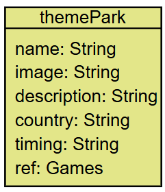
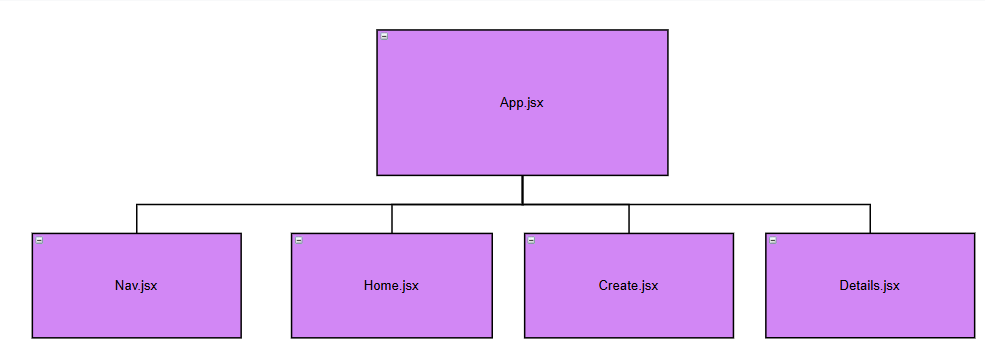

# Project Title: ThemeParks
## Date: 20/10/2025
### By:  Eman Qarooni, Mohamed Janahi

[Eman GitHub](https://github.com/emanqarooni ) |
[Mohammed GitHub](https://github.com/Mohamed-Janahi)

***

### ***Description***
#### Theme park is a website that previews different theme parks around the world and shows their descriptions and the games in each theme park.

#### ***Functionalities***
* The user can view different theme parks
* The user can view each theme park's description.
* The user can view each theme park games.
* The user can add a theme park.
* The user can delete a theme park.

### ***Deployed version***

##### [ThemePark]()

### ***Technologies***
* React

* vite
* NodeJs
* CSS

***
### ***Screenshots***

### ***Future Updates***
 - Users can edit theme parks.
 - More theme parks will be added [ ]
 - Only user who added a theme park will be able to delete it [ ]
 - More animations and polishing of the backend & frontend [ ]

***

### ***Credits***
#####
